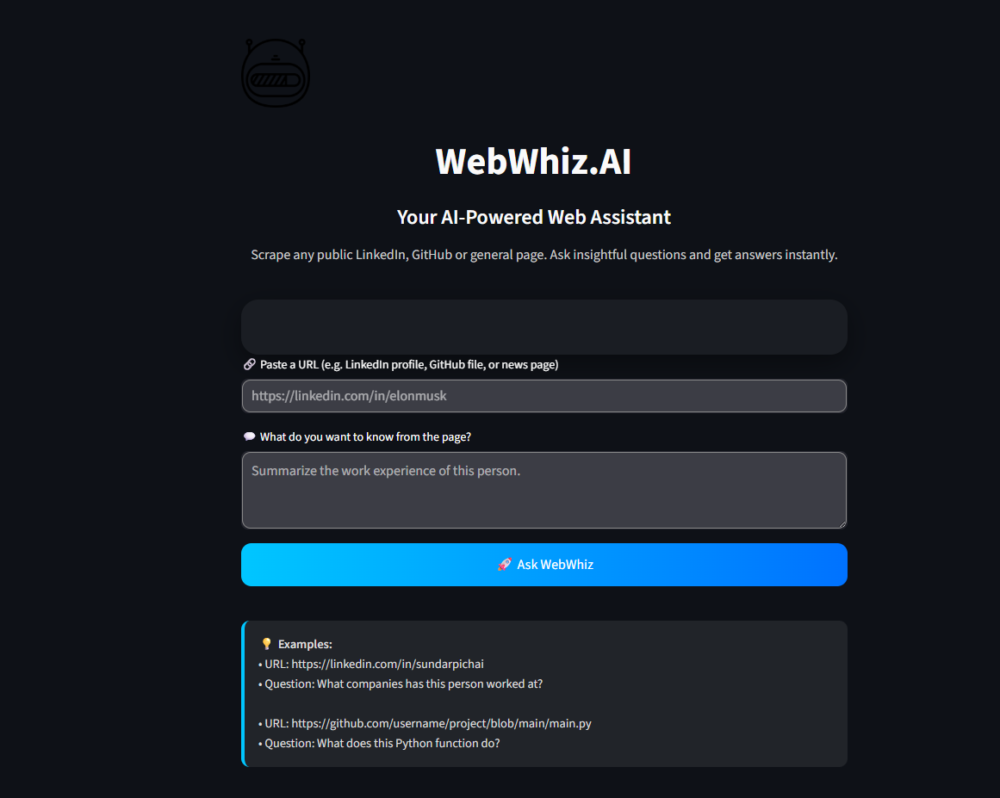

# 🤖 WebWhiz.AI

**Your AI-Powered Web Assistant**  
WebWhiz.AI scrapes public URLs like LinkedIn profiles, GitHub files, or general web pages and uses an LLM to generate insightful responses to your questions.

---

## 🌐 Overview

WebWhiz.AI allows users to:

- Enter any public URL (LinkedIn, GitHub, or general website)
- Ask questions like "Summarize the work experience" or "What does this code do?"
- Get instant answers using scraped data + LLM reasoning

Built with:
- 🧠 [LangChain](https://www.langchain.com/)
- 🦙 [Ollama](https://ollama.com/) (Gemma3 or your preferred model)
- 🕸️ [Bright Data MCP](https://brightdata.com/)
- ⚡ [Streamlit](https://streamlit.io/)

---

## 📸 Demo



---

## 🚀 How to Run Locally

### 1. Clone the Repository

```bash
git clone https://github.com/nishanroy561/WebWhiz.AI-Your-AI-Powered-Web-Assistant.git
cd WebWhiz.AI-Your-AI-Powered-Web-Assistant
